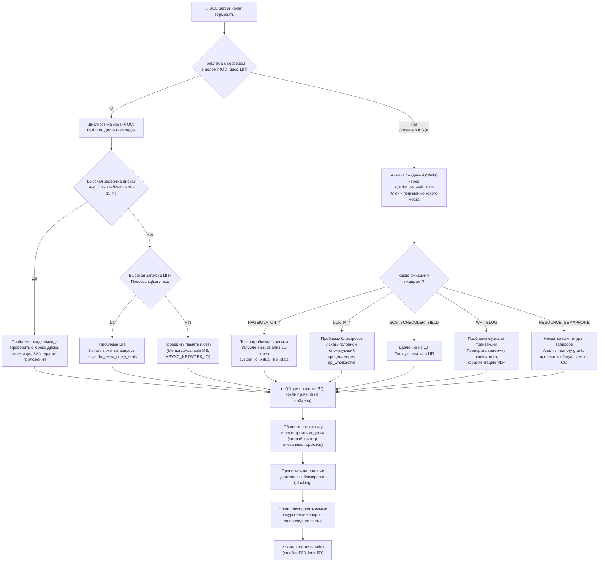

Когда SQL Server начинает тормозить, важно действовать системно, чтобы быстро найти причину и не тратить время на ненужные проверки. Вот практичный порядок действий, объединяющий стандартный подход с опытом администраторов. Его суть — отсекать целые классы проблем, двигаясь от внешних к внутренним причинам.



### 🎯 Шаг 1: Быстрая диагностика уровня ОС и SQL

На этом этапе определяем, где искать проблему: в целом на сервере (ОС, диск, ЦП) или локально в SQL Server.

**1. Проблема с сервером в целом?**
- **Симптомы**: медленно работает мышь, не отвечает RDP, тормозят все приложения.
- **Что делать**: Откройте **Диспетчер задач** или **Монитор ресурсов**. Посмотрите:
    - **Диск**: Загрузка 100%, высокая **средняя длина очереди** (более 2-5 для HDD, более 10-20 для SSD — уже тревожно). Ключевой показатель — **Avg. Disk sec/Read** (среднее время чтения с диска). Значение **более 10-15 мс** — явный признак проблемы с подсистемой ввода-вывода.
    - **ЦП**: Загружен ли процесс **sqlservr.exe**? Если да, переходим к анализу запросов. Если нет, возможно, проблема в другом процессе.
    - **Память**: Достаточно ли свободной оперативной памяти (**Memory\Available MBytes**)? SQL Server будет страдать, если системе не хватает памяти.

**2. Проблема локально в SQL Server?**
Запустите базовый скрипт для анализа **типов ожиданий (wait types)** — это главный ключ к пониманию, на чем "застрял" сервер.

```sql
-- Какие ожидания накапливаются в системе?
SELECT TOP 10 wait_type, waiting_tasks_count, wait_time_ms
FROM sys.dm_os_wait_stats
WHERE wait_type NOT IN ('CLR_SEMAPHORE', 'LAZYWRITER_SLEEP', 'RESOURCE_QUEUE', 'SLEEP_TASK',
                        'SOS_WORK_DISPATCHER', 'XE_DISPATCHER_WAIT', 'XE_TIMER_EVENT', 'DIRTY_PAGE_POLL')
ORDER BY wait_time_ms DESC;
```
**Как интерпретировать результат (Top Waits)**:
- **`PAGEIOLATCH_*`** (например, `SH`, `EX`): Ждут данные с диска. Явный признак **проблемы с I/O** или нехватки памяти (данные не помещаются в кэш).
- **`LCK_M_*`** (например, `LCK_M_S`, `LCK_M_U`): Ожидание **блокировки**. Указывает на конкуренцию за данные, возможно, длинную транзакцию.
- **`WRITELOG`**: Ожидание записи в **журнал транзакций**. Медленный диск для лога или слишком много маленьких транзакций.
- **`ASYNC_NETWORK_IO`**: Часто указывает на проблему **сети** или клиентское приложение, которое медленно забирает результаты.
- **`CXPACKET`**: Ожидание, связанное с **параллельным выполнением** запросов. Может указывать на неравномерное распределение нагрузки между потоками.
- **`SOS_SCHEDULER_YIELD`**: Задачи добровольно уступают процессор, ожидая своей очереди. Может указывать на **давление на ЦП**.
- **`RESOURCE_SEMAPHORE`**: Ожидание **выделения памяти** для выполнения запроса (например, для сортировки или хэширования).

### 🔍 Шаг 2: Углубленный анализ по направлению

Определив область проблемы, переходим к детальному анализу.

**Если проблема с I/O (PAGEIOLATCH, высокий Avg. Disk sec)**
1.  **Узнайте, какие файлы тормозят**:
    ```sql
    -- Задержка на уровне файлов БД
    SELECT DB_NAME(vfs.database_id) AS DB,
           mf.physical_name,
           CASE WHEN num_of_reads > 0 
                THEN (io_stall_read_ms / num_of_reads) 
                ELSE 0 END AS [Avg Read Latency (ms)],
           CASE WHEN num_of_writes > 0 
                THEN (io_stall_write_ms / num_of_writes) 
                ELSE 0 END AS [Avg Write Latency (ms)]
    FROM sys.dm_io_virtual_file_stats(NULL, NULL) AS vfs
    JOIN sys.master_files AS mf ON vfs.database_id = mf.database_id 
                                   AND vfs.file_id = mf.file_id
    ORDER BY [Avg Read Latency (ms)] DESC;
    ```
2.  **Проверьте аппаратные/системные причины**: Антивирус, сканирующий файлы БД? Другие приложения грузят диск? Проблемы с SAN/драйверами? Рекомендуется исключить папки с данными и логами SQL из антивирусной проверки.
3.  **Найдите "прожорливые" запросы**, вызывающие много физических чтений:
    ```sql
    SELECT TOP 10 qs.execution_count,
           qs.total_logical_reads / qs.execution_count AS avg_logical_reads,
           qs.total_physical_reads / qs.execution_count AS avg_physical_reads,
           SUBSTRING(st.text, (qs.statement_start_offset/2) + 1,
           ((CASE qs.statement_end_offset WHEN -1 THEN DATALENGTH(st.text)
            ELSE qs.statement_end_offset END - qs.statement_start_offset)/2) + 1) AS query_text
    FROM sys.dm_exec_query_stats AS qs
    CROSS APPLY sys.dm_exec_sql_text(qs.sql_handle) AS st
    ORDER BY qs.total_physical_reads DESC;
    ```

**Если проблема с ЦП (высокая загрузка sqlservr.exe, SOS_SCHEDULER_YIELD)**
Найдите запросы, потребляющие больше всего процессорного времени:
```sql
SELECT TOP 10 qs.execution_count,
       qs.total_worker_time / qs.execution_count AS avg_cpu_time,
       qs.total_worker_time AS total_cpu_time,
       SUBSTRING(st.text, (qs.statement_start_offset/2) + 1,
       ((CASE qs.statement_end_offset WHEN -1 THEN DATALENGTH(st.text)
        ELSE qs.statement_end_offset END - qs.statement_start_offset)/2) + 1) AS query_text
FROM sys.dm_exec_query_stats AS qs
CROSS APPLY sys.dm_exec_sql_text(qs.sql_handle) AS st
ORDER BY qs.total_worker_time DESC;
```
Далее смотрите планы выполнения этих запросов, возможно, им не хватает индексов или актуальной статистики.

**Если проблема с блокировками (LCK_M_*)**
Найдите главный блокирующий процесс:
```sql
-- Используйте встроенную процедуру или известные DMV
EXEC sp_whoisactive @find_block_leaders = 1; -- Если установлена
-- Или "ручной" запрос
SELECT session_id, blocking_session_id, wait_type, wait_time, command,
       (SELECT text FROM sys.dm_exec_sql_text(sql_handle)) AS query_text
FROM sys.dm_exec_requests
WHERE blocking_session_id > 0;
```
Устраните причину длительной блокировки (оптимизируйте запрос, разбейте транзакцию, проверьте клиентское приложение).

**Если проблема с памятью (RESOURCE_SEMAPHORE, PAGELATCH_*)**
Проверьте, не исчерпана ли память, выделенная SQL Server, и нет ли давления со стороны ОС. Посмотрите на `Memory\Available MBytes` в Perfmon.

### 📊 Шаг 3: Общие проверки внутри SQL Server (если причина не ясна)

Когда очевидных проблем с ресурсами нет, но сервер "тупит", проверьте следующие частые причины:

1.  **Статистика и индексы**. **Самая частая причина внезапного падения производительности без изменений в коде**. Планы запросов строятся на устаревших данных о распределении.
    - **Быстрое решение/проверка**: Обновите статистику и перестройте индексы для проблемной базы. Для Production сначала протестируйте на копии или в период наименьшей нагрузки, так как перестроение индексов может блокировать таблицы.
    ```sql
    -- Обновить статистику для одной базы
    EXEC sp_updatestats;
    ```
2.  **Параметр `Parameter Sniffing`**. Хранимая процедура, которая вчера летала, сегодня ползет. Кэшированный план, созданный для "плохих" входных параметров, используется для всех вызовов.
    - **Что делать**: Временно для проблемной процедуры добавьте `WITH RECOMPILE` или `OPTION (RECOMPILE)` в запрос внутри неё. Для постоянного решения может потребоваться более глубокая оптимизация.
3.  **Проверьте `tempdb` на contention**. Если все вдруг начало медленно работать, и вы видите ожидания с префиксом `PFS`, `SGAM` или `PAGELATCH_UP` в `tempdb`, это может быть проблема совместного использования.
    - **Быстрая проверка**: Убедитесь, что для `tempdb` создано несколько файлов данных (обычно по одному на ядро ЦП, но не более 8), одинакового размера.
4.  **Загляните в журнал ошибок SQL** на предмет критических сообщений (ошибка 833 — очень долгие операции ввода-вывода, предупреждения о нехватке памяти).

### 💎 Практические советы и вывод

*   **Системный подход — ключ**: Следуйте по цепочке: ОС -> Ожидания SQL -> Конкретный ресурс (I/O, ЦП, блокировки) -> Конкретный запрос.
*   **"А что изменилось?"**: Всегда задавайте этот вопрос. Новое обновление, измененный запрос, выросший объем данных, обновление драйверов?
*   **Не паникуйте и фиксируйте**: В критической ситуации сохраняйте спокойствие. По возможности делайте снимки ключевых показателей (ожидания, активные запросы) до вмешательства, чтобы было с чем сравнить.
*   **Что в вашем арсенале?** Укажите, с какими инструментами вам привычнее работать (Perfmon, Extended Events, сторонние скрипты вроде `sp_WhoIsActive`), и я могу дать более конкретные советы по их применению в этом сценарии.
*   
