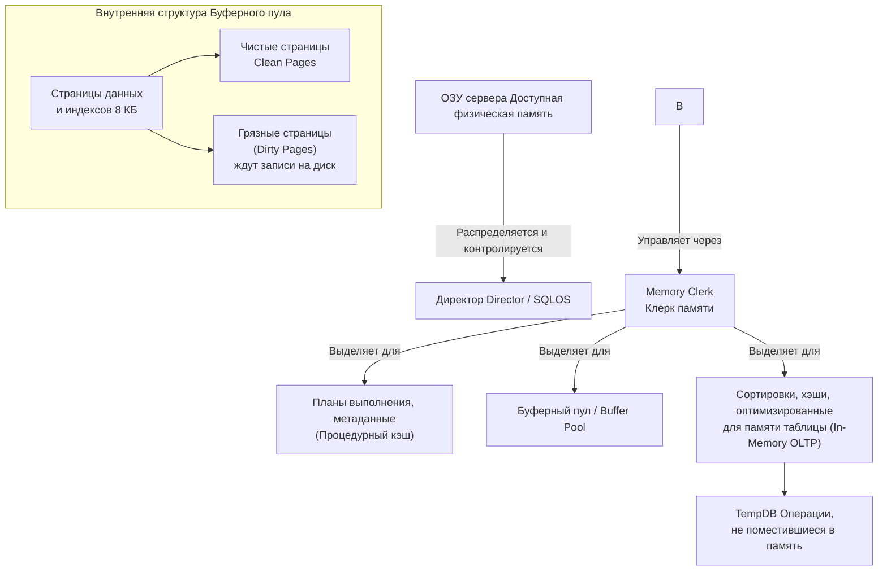

Модель памяти SQL Server можно представить как иерархию, где доступ к памяти происходит через «клерков памяти». Эти клерки отвечают за распределение памяти между основными потребителями, главным из которых является буферный пул.

Для наглядности процесс управления памятью показан на схеме ниже:



Теперь давайте детально разберем каждый компонент, его работу под нагрузкой и как за ним следить.

### 🏗️ Уровень 1: Ядро управления памятью (Memory Manager)
**Что это и зачем**: Главный «директор» всей памяти SQL Server, часть подсистемы SQLOS. Его задача — динамически распределять память между компонентами сервера, освобождая её обратно в ОС при нехватке. Начиная с SQL Server 2012, под его управление попали практически все внутренние выделения памяти (ранее называемые `Single-Page` и `Multi-Page`), что сделало управление более точным.

**Как работает под нагрузкой**: При высокой нагрузке диспетчер пытается балансировать между двумя целями: минимизировать операции ввода-вывода на диск (для чего нужен большой буферный пул) и не доводить систему до дефицита оперативной памяти. Когда память заканчивается, он вынужден чаще сбрасывать («красть») страницы из буфера под системные нужды или записывать «грязные» страницы на диск.

**Как мониторить**: Ключевые показатели — `Total Server Memory` (сколько уже занято) и `Target Server Memory` (сколько хочет занять сервер для текущей нагрузки). Их можно получить так:
```sql
-- Ключевые счетчики памяти сервера
SELECT
    (committed_kb / 1024) AS Total_Server_Memory_MB,
    (committed_target_kb / 1024) AS Target_Server_Memory_MB
FROM sys.dm_os_sys_info;

-- Детализация по клеркам (главным потребителям)
SELECT TOP 10
    [type] AS MemoryClerkType,
    SUM(pages_kb) / 1024 AS Size_MB
FROM sys.dm_os_memory_clerks
WHERE pages_kb != 0
GROUP BY [type]
ORDER BY Size_MB DESC;
```
Если `Total` стабильно близок к `Target` — сервер использует столько памяти, сколько считает нужным. Если `Total` заметно ниже `Target` — сервер не может получить желаемый объем из-за нехватки ресурсов в системе.

### 🗂️ Уровень 2: Буферный пул (Buffer Pool / Buffer Cache)
**Что это и зачем**: Главный и крупнейший потребитель памяти, цель которого — кэшировать страницы данных и индексов (по 8 КБ каждая) в оперативной памяти, чтобы избежать медленных чтений с диска.

**Как работает под нагрузкой**:
*   Под постоянной записью в буфере накапливаются **«грязные страницы»** (измененные, но еще не записанные на диск).
*   Процесс **Lazy Writer** или **Checkpoint** периодически сбрасывает их на диск.
*   Если памяти не хватает, SQL Server вынужден чаще очищать буфер, вытесняя старые страницы. Показатель **Page Life Expectancy** начинает падать.

**Как мониторить**:
```sql
-- Эффективность кэша (Buffer Cache Hit Ratio)
SELECT *
FROM sys.dm_os_performance_counters
WHERE counter_name = 'Buffer cache hit ratio'
   OR counter_name = 'Page life expectancy';

-- Просмотр «грязных» страниц
SELECT COUNT(*) * 8 / 1024 AS DirtyPages_MB
FROM sys.dm_os_buffer_descriptors
WHERE is_modified = 1;
```
*   **Buffer Cache Hit Ratio**: стремится к 100%. Значение ниже 90-95% указывает на частые чтения с диска и потенциальную нехватку ОЗУ.
*   **Page Life Expectancy (PLE)**: время жизни страницы в буфере в секундах. Резкое падение (например, с тысяч до сотен секунд) — признак давления на память.

### 💾 Уровень 3: Процедурный кэш (Plan Cache)
**Что это и зачем**: Хранит скомпилированные планы выполнения запросов, чтобы избежать повторной дорогостоящей компиляции.

**Как работает под нагрузке**: При нехватке памяти SQL Server начинает агрессивно удалять старые и неиспользуемые планы из кэша. Это может привести к учащению компиляций (рост `SQL Compilations/sec`), что увеличивает нагрузку на ЦП.

**Как мониторить**:
```sql
-- Размер и активность кэша планов
SELECT
    COUNT(*) AS CachedPlansCount,
    SUM(size_in_bytes) / 1048576.0 AS TotalSize_MB,
    SUM(CAST(usecounts AS BIGINT)) AS TotalUseCount
FROM sys.dm_exec_cached_plans;

-- Поиск «одноразовых» планов, засоряющих кэш
SELECT objtype, COUNT(*) AS PlansCount,
       SUM(size_in_bytes) / 1048576.0 AS Size_MB
FROM sys.dm_exec_cached_plans
WHERE usecounts = 1
GROUP BY objtype
ORDER BY Size_MB DESC;
```

### ⚙️ Уровень 4: Память для выполнения запросов (Memory Grants)
**Что это и зачем**: Операции вроде сортировки (`SORT`) или хэширования (`HASH JOIN`) требуют выделения дополнительной рабочей памяти. Выделение называется «грантом памяти» (Memory Grant).

**Как работает под нагрузке**: При высокой конкуренции за память запросы выстраиваются в очередь на получение гранта, появляются ожидания `RESOURCE_SEMAPHORE`. Если памяти не хватает катастрофически, SQL Server может начать использовать `tempdb` для промежуточных результатов (`spills`), что резко замедляет выполнение.

**Как мониторить**:
```sql
-- Ожидания грантов (должно быть 0 в норме)
SELECT *
FROM sys.dm_exec_query_memory_grants;

-- Очередь на получение памяти
SELECT *
FROM sys.dm_exec_query_resource_semaphores;

-- Прямой счетчик через Performance Monitor
-- SQLServer: Memory Manager -> Memory Grants Pending
```

### 🔧 Практические шаги для диагностики «тупит»

1.  **Быстрая проверка очередей**: Посмотрите на `Memory Grants Pending` в PerfMon. Значение > 0 — явный признак нехватки памяти для выполнения запросов.
2.  **Анализ кэша**: Проверьте `Buffer Cache Hit Ratio` и `Page Life Expectancy`. Низкие значения — сигнал к увеличению доступной памяти или оптимизации запросов.
3.  **Поиск главных потребителей**: Запустите запрос к `sys.dm_os_memory_clerks`. Это покажет, на что именно тратится память (буферный пул, кэш планов и т.д.).
4.  **Проверка системного давления**: Не забудьте посмотреть на **Available MBytes** в PerfMon на уровне ОС. Если свободной памяти мало, проблема может быть в соседних с SQL Server процессах.

### 💎 Ключевые параметры конфигурации: `min` и `max server memory`
Эти параметры устанавливают границы для основной массы памяти SQL Server. Их **обязательно нужно настраивать**.

*   **`max server memory`**: Задает верхний предел. **Правило**: `Общая память сервера - (память для ОС ~2-4ГБ + память для других приложений)`. Например, на сервере с 64 ГБ, где больше ничего не работает, можно установить 58-60 ГБ.
*   **`min server memory`**: Задает нижнюю границу, ниже которой SQL Server не будет освобождать память под давлением ОС. Полезно в виртуализованных средах.

**Как задать**:
```sql
EXEC sp_configure 'show advanced options', 1;
RECONFIGURE;
EXEC sp_configure 'max server memory', 61440; -- 60 ГБ в МБ
EXEC sp_configure 'min server memory', 4096;  -- 4 ГБ в МБ
RECONFIGURE;
```
